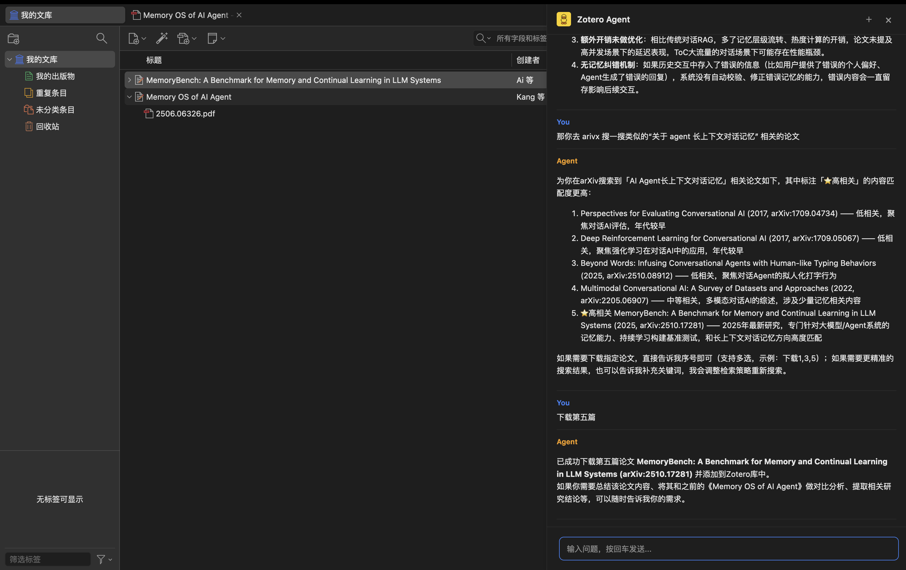
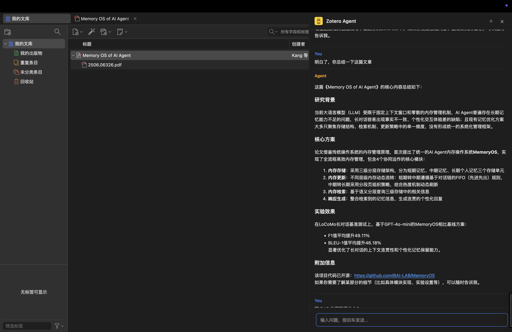
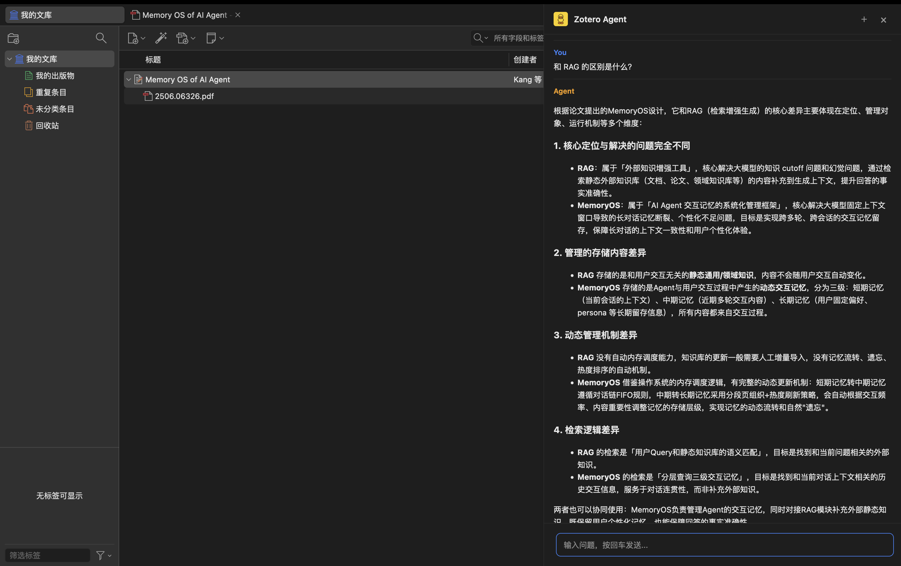
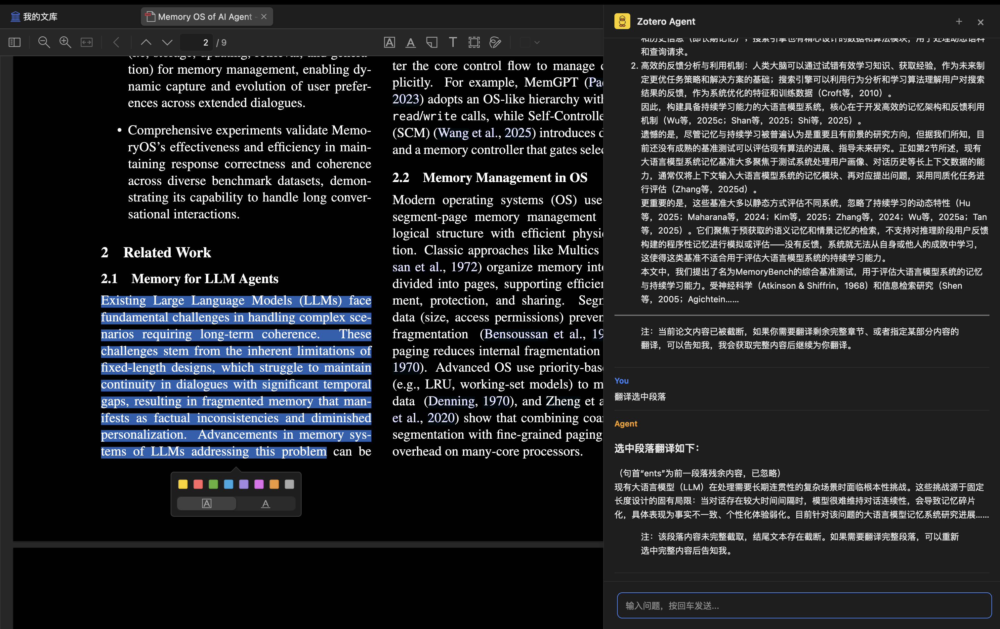
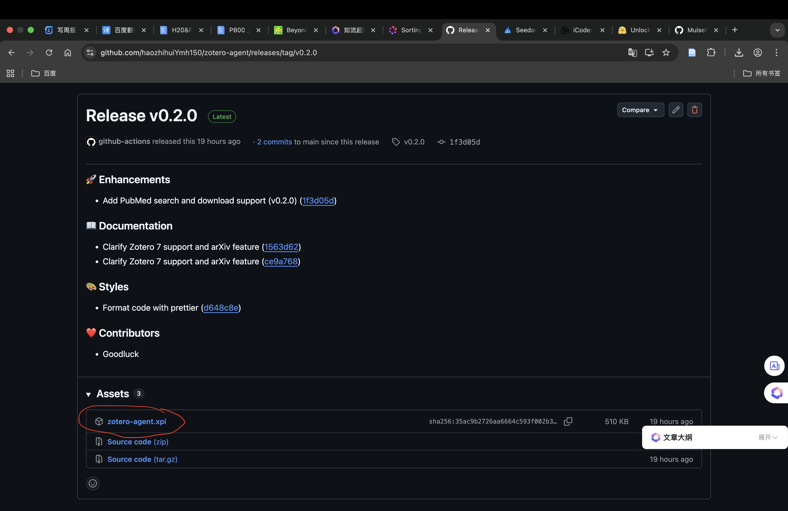
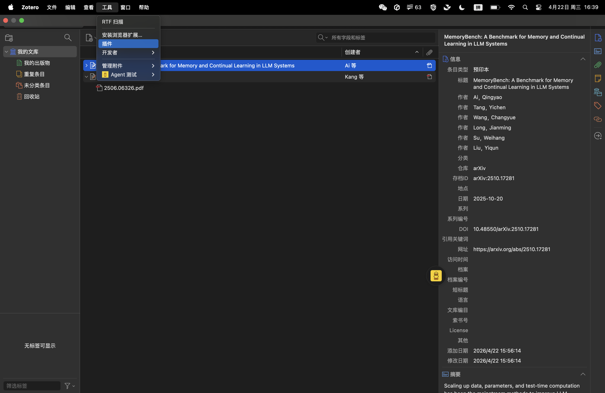
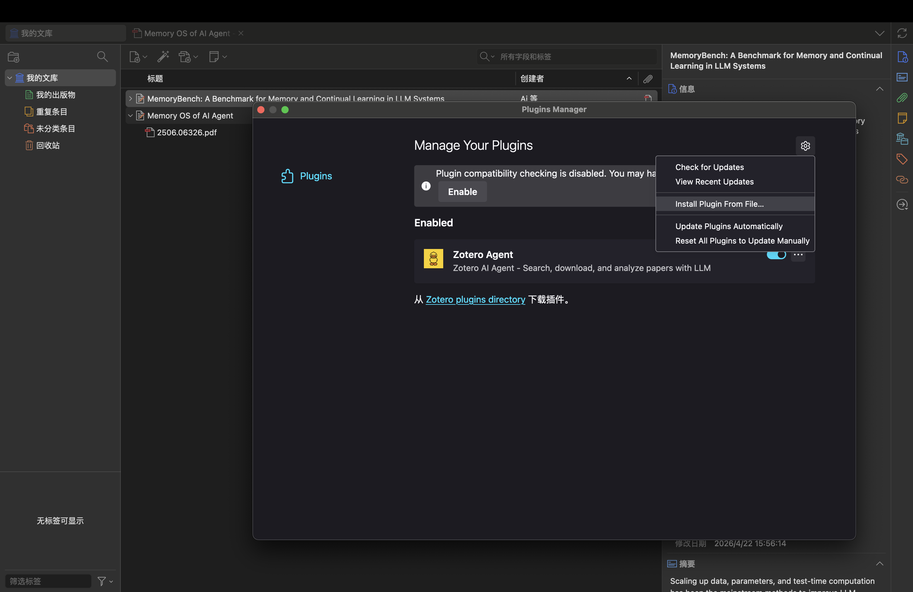

<p align="center">
  
</p>

<p align="center">
  <a href="https://www.zotero.org"></a>
  <a href="../../releases/latest"></a>
  <a href="../../releases"></a>
  <a href="LICENSE"></a>
</p>

Cursor 让 VS Code 有了灵魂，Zotero Agent 让 Zotero 不再只是文献仓库。

它能帮你**搜论文、下论文、读论文、问论文**——你只需要说话，它来干活。

## 为什么选择 Zotero Agent？

> 本项目受 [Zotero-GPT](https://github.com/MuiseDestiny/zotero-gpt) 启发，感谢原作者的开创性工作。

| 功能 | Zotero Agent | Zotero-GPT |
|------|:------------:|:----------:|
| AI 论文问答 | ✅ | ✅ |
| arXiv 搜索下载 | ✅ | ❌ |
| PubMed 搜索下载 | ✅ | ❌ |
| 国内外大模型 | ✅ 豆包/DeepSeek/OpenAI 等 | ✅ |
| 无需翻墙 | ✅ 支持国内模型 | 取决于模型 |

## 核心功能

### 1. 论文搜索下载（独有）

直接在对话框里搜索，一键下载到 Zotero：



目前支持 **arXiv** 和 **PubMed**，更多论文源持续添加中。PubMed 会自动尝试从 PMC 或 Unpaywall 获取免费 PDF。

### 2. AI 论文问答

选中论文，像聊天一样提问：





### 3. PDF 选中文本解读

在 PDF 阅读器中选中一段文字，直接提问：



### 4. 文献管理（即将推出）

将来还会新增 Zotero 文献管理功能，比如查询和归档整理。更多需求，请提 [Issues](../../issues)。

## 安装

1. 下载 [zotero-agent.xpi](../../releases/latest)

   

2. Zotero → `Tools` → `Plugins`

   

3. 点击 ⚙️ → `Install Plugin From File...` → 选择刚才下载的 xpi 文件

   

## 配置 AI（5 分钟）

> **注意**：目前仅在豆包模型上充分测试，其他模型（DeepSeek、通义千问等）即将支持。如果你在使用其他模型时遇到问题，欢迎 [反馈](../../issues)。

点击右下角  图标打开对话框，输入以下命令：

### 方案一：豆包（推荐，新用户送 50 万 tokens）

1. 注册 [火山引擎](https://console.volcengine.com/ark)，创建 API Key
2. 配置：
```
/apibase https://ark.cn-beijing.volces.com/api/v3
/apikey 你的密钥
/model doubao-seed-2-0-pro-260215
```

### 方案二：DeepSeek（便宜）

1. 注册 [DeepSeek 开放平台](https://platform.deepseek.com/)，创建 API Key
2. 配置：
```
/apibase https://api.deepseek.com
/apikey 你的密钥
/model deepseek-chat
```

### 方案三：通义千问

1. 注册 [阿里云百炼](https://bailian.console.aliyun.com/)，创建 API Key
2. 配置：
```
/apibase https://dashscope.aliyuncs.com/compatible-mode/v1
/apikey 你的密钥
/model qwen-plus
```

输入 `/config` 确认配置成功。

## 命令列表

| 命令　　　　　　　| 说明　　　　　|
| -------------------| ---------------|
| `/apibase <地址>` | 设置 API 地址 |
| `/apikey <密钥>`　| 设置 API 密钥 |
| `/model <模型名>` | 设置模型　　　|
| `/config`　　　　 | 查看当前配置　|
| `/clear`　　　　　| 清空对话历史　|
| `/help`　　　　　 | 显示帮助　　　|
| `/reset`　　　　　| 重置所有配置　|

## 常见问题

**Q: 支持 Zotero 6 吗？**
A: 目前只支持 Zotero 7。

**Q: 可以用 OpenAI/Claude 吗？**
A: 可以，任何兼容 OpenAI API 格式的服务都能用。

**Q: 论文太长 AI 读不完？**
A: 建议选中具体段落提问，或使用支持长上下文的模型（如 doubao-seed-2-0-pro）。

## 反馈交流

- 问题反馈：[GitHub Issues](../../issues)
- 交流群：TODO

## 开源协议

AGPL-3.0-or-later
